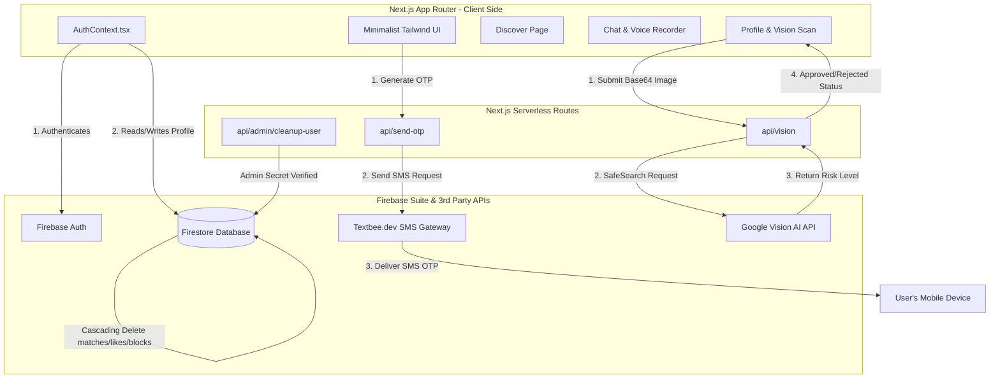

# 💎 Datie. - Senior Developer Interview Prep Guide & System Architecture

Welcome! This guide is written from the perspective of a **Senior Software Engineer/Architect**. It breaks down the complete **Datie.** codebase, design patterns, and engineering trade-offs. 

Use this document to prepare for your interview. It will help you explain *not just what* the code does, but *why* it was built this way (architectural decisions, security considerations, and scalability).

---

## 🗺️ High-Level System Architecture

**Datie.** is a high-security, premium dating platform tailored for the Malayali community (referred to in the code as "Kerala's Elite Dating Protocol"). The platform is built around a **"Security-First"** philosophy, preventing the spam, bots, and safety hazards common in mainstream dating apps.



---

## 🛠️ Technology Stack & Selection Rationale

| Technology | Purpose | Rationale / Interview Talking Point |
| :--- | :--- | :--- |
| **Next.js 15+ (App Router)** | Framework | Provides a unified structure for both the React-based frontend and serverless API endpoints. Page directories map directly to route paths, utilizing Client/Server Component hybrids. |
| **React 19 & Context API** | Frontend Library | React 19 handles client state. The context-driven approach (`AuthContext.tsx`) manages session details globally without needing heavy state packages like Redux. |
| **Firebase Suite (Auth, Firestore)** | Backend-as-a-Service | Firestore provides low-latency document syncing. Firebase Auth securely manages credentials. This combo allows rapid deployment with built-in websocket-style updates (`onSnapshot`). |
| **TailwindCSS v4** | Styling | Offers high-performance utility styles. This helps construct the monochrome, luxury-fashion design language with zero styling-overhead compilation. |
| **Anime.js v4** | Animations | Delivers premium, high-fidelity micro-interactions (e.g., card entrances, fade-ins, and logo glows) that default CSS keyframes can't achieve smoothly. |
| **Google Vision AI** | Image Moderation | Server-side automated content filtering using machine learning to detect inappropriate content (SafeSearch Annotation) instantly. |
| **Textbee.dev** | SMS Gateway | A free Android SMS gateway. It routes programmatic SMS through an Android device using an API key, bypassing expensive Twilio costs for demo environments. |

---

## 🛡️ Critical Security Flows (Deep Dive)

### 1. Phone-First SMS Gateway (`src/app/signup/page.tsx` & `src/app/api/send-otp/route.ts`)
Instead of relying on simple email verification, users must provide a verified phone number.
* **Code Flow:**
  1. The user inputs their phone number during signup.
  2. The frontend generates a secure, 6-digit OTP code (`mockCode` via `Math.random()`) and triggers a `POST` request to `/api/send-otp`.
  3. The serverless API checks the environment for the `TEXTBEE_API_KEY` and `TEXTBEE_DEVICE_ID`. It formats the phone number (defaulting to the country code `+91` for India/Kerala if missing) and calls Textbee's API:
     `https://api.textbee.dev/api/v1/gateway/devices/{DEVICE_ID}/send-sms`
  4. **Fallback Mechanism (Developer-Friendly):** If the Textbee gateway is not configured or fails, the backend returns the error, and the client displays the OTP code in a warning toast. This prevents development blockers while maintaining production logic.
  5. Once the user enters the matching code, the client proceeds to create their Firebase Auth credentials and Firestore user record.

### 2. AI Content Filtering (`src/app/profile/page.tsx` & `src/app/api/vision/route.ts`)
To prevent fake profiles or inappropriate profile pictures, **Datie.** uses Google Vision API.
* **Code Flow:**
  1. The user uploads a photo in their profile editor (restricted to `< 800KB` to limit payload size and save Firestore document space).
  2. The frontend reads the file as a Base64 string via the `FileReader` API.
  3. A `POST` request is sent to `/api/vision` containing the base64 data.
  4. The serverless route invokes the Google Vision Annotate endpoint with the `SAFE_SEARCH_DETECTION` feature:
     ```json
     { "features": [{ "type": "SAFE_SEARCH_DETECTION" }] }
     ```
  5. The API checks the annotations: `adult`, `violence`, and `racy`. If Google returns `LIKELY` or `VERY_LIKELY` for any of these, the API returns `{ safe: false }`.
  6. If safe, the frontend updates the Firestore document with the Base64 image URL. If unsafe, it triggers an instant rejection toast.

### 3. Cascading Admin Deletion (`src/app/api/admin/cleanup-user/route.ts`)
When an account is deleted or reported/purged by an Admin, a cascading deletion process is triggered to avoid leaving orphaned records in the database.
* **Code Flow:**
  1. The Admin enters their Dashboard and requests a purge. It calls `/api/admin/cleanup-user` passing the target `uid` and an `adminSecret` checking against `process.env.NEXT_PUBLIC_ADMIN_KEY`.
  2. The API carries out 4 sequential deletions:
     - **Matches & Messages:** Queries all matches involving the user, deletes all nested messages in the `messages` subcollection using a `writeBatch(db)`, then deletes the match document itself.
     - **Likes:** Queries all likes where the user was the sender (`from`) or recipient (`to`), and deletes them in a batch.
     - **Blocks:** Queries all blocks sent or received by the user and deletes them in a batch.
     - **Profile:** Deletes the core user profile document in the `users` collection.
  3. **Auto-Purge Sync on Client:** If a user's Firestore profile is deleted by an admin while they are still in Firebase Auth, `AuthContext.tsx` detects this discrepancy on the next auth state change (`onAuthStateChanged`). It calls `deleteUser(firebaseUser)` to clean up the Auth record, or forces a logout if re-authentication is required.

---

## 🗄️ Database Schema & Rules Design

### Firestore Schema Structure
Firestore is a document database. Here is how **Datie.** maps its connections:

```
├── users (collection)
│   └── [userId] (document)
│       ├── uid: string
│       ├── name: string
│       ├── email: string
│       ├── phone: string
│       ├── phoneVerified: boolean
│       ├── photoURL: string (stored as base64)
│       ├── district: string
│       ├── age: number
│       ├── bio: string
│       ├── religion: string
│       └── interests: string[]
│
├── likes (collection)
│   └── [userId_targetId] (document)
│       ├── from: string (sender UID)
│       ├── to: string (recipient UID)
│       └── timestamp: serverTimestamp
│
├── blocks (collection)
│   └── [blockerId_blockedId] (document)
│       ├── blocker: string
│       ├── blocked: string
│       └── timestamp: serverTimestamp
│
└── matches (collection)
    └── [sortedUserId1_sortedUserId2] (document)
        ├── users: string[] (array containing [UID1, UID2])
        ├── timestamp: serverTimestamp
        ├── lastMessage: string
        └── messages (subcollection)
            └── [messageId] (document)
                ├── senderId: string
                ├── type: string ("text" | "voice")
                ├── text: string (if type is text)
                ├── audioURL: string (base64 audio if type is voice)
                ├── edited: boolean
                └── timestamp: serverTimestamp
```

### Database Security Rules (`firestore.rules`)
Our security rules prevent users from reading other users' private messages, tampering with likes, or updating profiles that aren't theirs.

* **Helper Functions:**
  ```javascript
  function isSignedIn() { return request.auth != null; }
  function isOwner(userId) { return isSignedIn() && request.auth.uid == userId; }
  ```
* **Users:** Allowed to read any profile if signed in (to support the Discovery feed), but can only write if they own the record (`isOwner(userId)`).
* **Matches:** A user can read/write a match *only* if their UID is inside the `users` array in that match document:
  ```javascript
  allow read, write: if isSignedIn() && request.auth.uid in resource.data.users;
  ```
* **Nested Messages:** Security rules enforce relational validation: a message inside a match can only be read or written if the requester is part of the parent match's `users` array:
  ```javascript
  allow read, write: if isSignedIn() && request.auth.uid in get(/databases/$(database)/documents/matches/$(matchId)).data.users;
  ```
* **Likes & Blocks:** Rules guarantee that only the sender can write/delete their own likes and blocks.

---

## ⚡ Feature Mechanics (Step-by-Step Code Flows)

### A. The Discovery Query Engine (`src/app/discover/page.tsx`)
To keep the feed clean, **Datie.** filters profiles on both the server and client:
1. **Fetch Blocks:** Queries Firestore's `blocks` collection where `blocker == currentUser.uid` to get a list of blocked user IDs.
2. **Fetch Likes:** Queries Firestore's `likes` collection where `from == currentUser.uid` to retrieve who the user has already liked.
3. **Query Users:** Fetches users from the database, applying a limits cap of 100.
4. **Filter Pipeline:** The frontend filters this list in memory:
   - Excludes the current user (`u.uid !== user.uid`).
   - Ensures profile data exists (`u.name`).
   - Verifies the user completed SMS verification (`u.phoneVerified === true`).
   - Excludes any profile in the blocked list or already liked list.

### B. Double-Like Match Creation (`src/app/discover/page.tsx`)
When a user likes someone:
1. It writes a document to `likes` with ID `{user.uid}_{targetUser.uid}`.
2. It executes a look-up to see if the reverse document exists: `likes/{targetUser.uid}_{user.uid}`.
3. If it exists, a mutual match is formed!
4. The frontend writes to `matches/{sortedUid1_sortedUid2}`. Using a sorted compound ID guarantees that the match document key is unique and deterministic, preventing duplicate matches.

### C. Chat Smart Shield (`src/app/chat/[matchId]/page.tsx`)
1. **Profanity Filter:** In-app sanitization inspects the text, cross-referencing words against a blocklist (`"toxic"`, `"abuse"`, etc.) and replacing them with asterisks (`****`).
2. **Link Scanner:** A regex scans the string for external URLs (`/(https?:\/\/[^\s]+)/g`). If detected, it pops up a warning dialog to prevent scam links and phishing.
3. **Total Control:**
   - **Editing:** Updates the text document in Firestore with `{ text: newText, edited: true }`.
   - **Deleting:** Deletes the specific message document from the subcollection.
   - **Blocking:** Instantly creates a block document and deletes the parent match record, ending the chat channel immediately.

### D. Media Streaming: Voice Notes (`src/app/chat/[matchId]/page.tsx`)
Rather than dealing with slow uploads to Cloud Storage during chat, **Datie.** stores short voice notes as Base64 text documents.
1. The user grants mic access via the `navigator.mediaDevices.getUserMedia` API.
2. The browser records the stream using the `MediaRecorder` API, outputting Ogg/Opus audio blocks.
3. On stop, the blob is parsed into a Data URL Base64 string using `FileReader`.
4. It is written to Firestore as a `type: "voice"` message, saving `audioURL: base64Audio`.
5. The `VoicePlayer` component plays this string natively using a hidden `<audio>` element and displays a styled wave-form using randomized heights.

---

## 💬 Interview Q&A Cheatsheet (Top 5 Questions)

#### Q1: "Why did you choose to store voice notes and images as Base64 strings instead of uploading them to Cloud Storage?"
* **Your Answer:** "For a demo-scale application, storing them as Base64 strings directly in Firestore document fields simplifies development and avoids storage network latency. However, for a production-scale application, this has trade-offs. Firestore documents have a 1MB size limit. While profile photos are constrained to 800KB and voice notes are kept short, a production version would upload these files to Firebase Cloud Storage, return a download URL, and store *only* the URL in Firestore. This would keep documents lightweight and cost-effective."

#### Q2: "How does the matching engine work, and how do you ensure that two users don't create duplicate match records?"
* **Your Answer:** "The matching engine uses a deterministic ID mapping strategy. When User A likes User B, we write a document in the `likes` collection. We then check if User B already liked User A by checking the reverse path. If they did, we create a match document. To prevent duplicate match documents, we sort the two user UIDs alphabetically and join them with an underscore (e.g., `uid1_uid2`). This guarantees a single, unique document ID for their connection, regardless of who swiped first."

#### Q3: "Explain how you protected the database from malicious writes and read requests."
* **Your Answer:** "I configured robust rules in `firestore.rules`. First, I wrote helper functions to verify authentication and ownership. For profile edits, only the owner of the document is allowed to write (`request.auth.uid == userId`). For chats, I restricted read and write actions to the two users who are in the match. I implemented this for the messages subcollection by querying the parent match document to verify the user's UID is in the `users` array. This prevents unauthorized access to private messages."

#### Q4: "What is the administrative cleanup route, and why was it necessary?"
* **Your Answer:** "Since dating applications require strict moderation, we have an admin dashboard. When a user requests account deletion, or is reported and purged by an administrator, we can't just delete their user record. We must remove all traces of their data to protect user privacy. The cleanup route is a serverless POST API protected by a master API key. It initiates a cascading deletion: it removes all matches involving the user, deletes all messages nested under those matches using write batches, removes all likes, deletes all blocks, and finally deletes the profile itself."

#### Q5: "How does your app handle auth state changes and what happens if an admin purges an active session?"
* **Your Answer:** "We wrap the app in an `AuthProvider` using the React Context API. It listens to Firebase's `onAuthStateChanged`. If a user is logged in, it retrieves their profile from Firestore. If the auth session is active but the Firestore profile doesn't exist anymore, it indicates that the account was purged by an admin. The auth provider handles this by automatically calling `deleteUser` on the client side to delete their auth credentials, keeping our authentication database clean and in sync with our Firestore database."

---

## 💡 Pro Tips for a Great Impression
* **Highlight "Cascading Deletion":** Interviewers love when you think about cleanup and data hygiene. Mentioning write batches and subcollection cleanups shows experience with database operations.
* **Emphasize "Aesthetics & UX":** Talk about how you used `Anime.js` for smooth transitions instead of harsh page jumps, showing that you value front-end detail.
* **Acknowledge Trade-Offs:** Always admit that Base64 storage in Firestore is a scaling bottleneck, but explain the Twilio/Firebase Storage alternatives. This shows architectural foresight.
