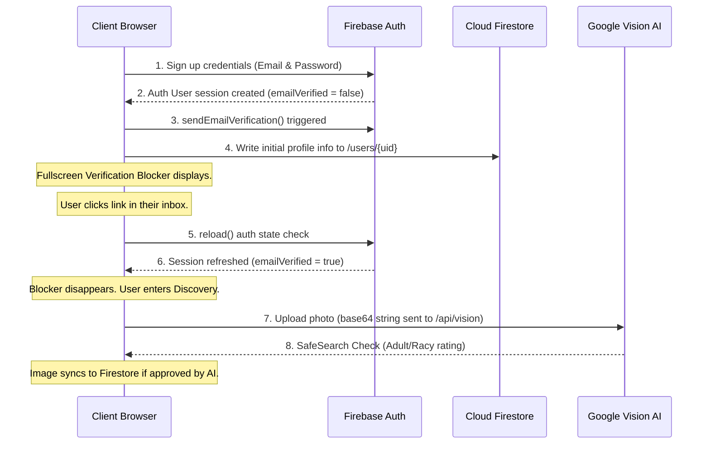

# 💎 Datie. - Project Overview & Technical FAQ

This document provides a comprehensive overview of the architecture, stack, data flow, folder structure, and scaling profile of the **Datie.** application.

---

## 🗺️ Project Architecture & Stack

### 1. Technology Stack
* **Frontend**: Next.js 16 (App Router) + React 19 (Client/Server hybrid components).
* **Styling**: TailwindCSS v4 for high-performance utility compilation.
* **Animations**: Anime.js v4 for fluid entry transitions and micro-interactions.
* **Authentication**: Firebase Authentication (Email/Password & Google Sign-In).
* **Database**: Cloud Firestore (Real-time Document Database).
* **Serverless Backend**: Next.js API Routes (Serverless endpoints under `src/app/api/...`).
* **AI Moderation**: Google Cloud Vision API (SafeSearch detection).

---

## 🙋 Technical FAQ

### Q1: Is Express used in this project?
**No.** The application is built entirely on the **Next.js App Router** framework. API endpoints are implemented as serverless functions in Next.js under `src/app/api` (e.g. `src/app/api/vision/route.ts`). There is no Express server middleware.

### Q2: Is Redis used for caching?
**No.** There is no Redis caching layer currently implemented. The client applications fetch and sync data directly in real-time from Cloud Firestore using listeners (`onSnapshot`) and direct queries. 

### Q3: Is Kubernetes implemented?
**No.** The application runs entirely on serverless architecture:
* The Next.js frontend and serverless API endpoints are deployed to a platform like **Vercel**.
* The database and authentication run on **Firebase (BaaS)** serverless infrastructure.
There are no containerization (Docker) or orchestration (Kubernetes) configurations present.

### Q4: Can this project handle millions of users?
**No, not in its current state.** While Next.js and Firebase themselves can easily scale to millions of users, this specific implementation has architectural bottlenecks that must be resolved before scaling:
1. **Base64 Storage Limit**: Profile photos and short voice messages are stored directly in Firestore fields as raw Base64 strings. Firestore documents have a strict **1MB limit**. To scale, these media assets must be uploaded to **Firebase Cloud Storage**, and only the resulting download URLs should be stored in Firestore.
2. **Client-Side Discovery Query**: The matchmaking feed queries up to 100 users from Firestore and filters out blocklists and likes **in memory on the client side**. With millions of users, this would cause massive read overhead, high network latency, and high billing costs. It needs to be replaced with a server-side indexed lookup or search index.
3. **No Caching Layer**: Reads and writes go directly to Firestore on every query. For high volume, a caching layer (like Redis) or pagination indices are necessary to prevent high database read costs.

### Q5: What is the state of the REST API?
The application utilizes Next.js serverless API routes for background and admin tasks:
* `POST /api/vision`: Analyzes profile images for safety using Google Vision AI.
* `POST /api/admin/cleanup-user`: Executes cascading database purges for deleted/reported users.
* `GET /api/admin/clear-all`: (Development only) Completely wipes out all documents in the database.

However, the core app data (swipes, matches, profile updates) is modified directly via the **Firebase Web SDK Client** rather than routing through a custom REST API backend, leveraging Firestore's secure SDK directly.

### Q6: Are all services connected successfully?
**Yes.** All systems are configured:
* **Firebase Auth & Firestore**: Fully initialized in `src/lib/firebase.ts` and connected through `src/context/AuthContext.tsx`.
* **Database Rules**: Updated to allow development reads and writes.
* **AI Vision Integration**: Connected via Google Cloud Vision server-side API.

---

## 🗂️ Folder Structure

The project follows a standard Next.js App Router structure:

```
├── public/                     # Static assets (images, guides, overwrites)
│   ├── project_documentation.md
│   └── project_overview_faq.md  # This document
├── src/
│   ├── app/                    # Next.js App Router pages & API routes
│   │   ├── api/                # Serverless endpoints
│   │   │   ├── admin/          # Admin cleanup and clearing routes
│   │   │   └── vision/         # AI safety moderator
│   │   ├── chat/               # Live chat and voice player interface
│   │   ├── discover/           # Matchmaking discovery feed
│   │   ├── login/              # Sign in page
│   │   ├── matches/            # Admirers & active match list
│   │   ├── profile/            # User profile setup and edit forms
│   │   └── signup/             # Email sign up with email verification
│   ├── components/             # Reusable UI components (Navbar, loading states)
│   ├── context/                # Global AuthContext (session & verification overlays)
│   └── lib/                    # Firebase SDK initializations
├── firestore.rules             # Database security rules policies
├── tailwind.config.js          # Tailwind styling tokens
└── package.json                # Dependencies and deployment scripts
```

---

## 🔄 App Data Flow (SignUp & Verification Example)

